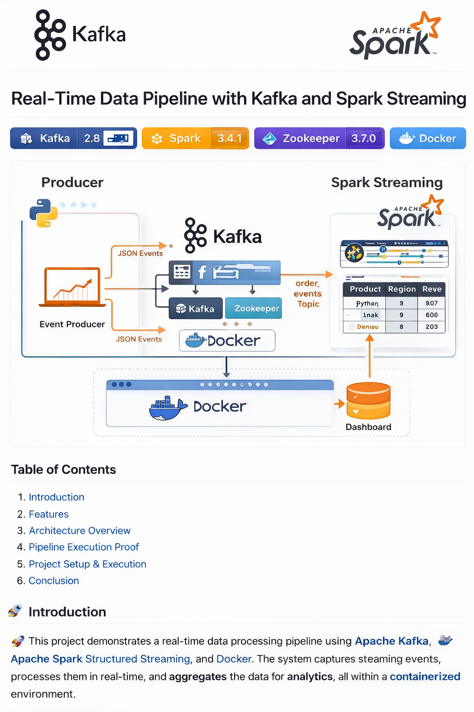
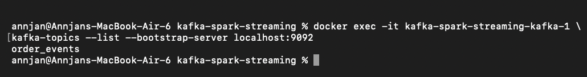
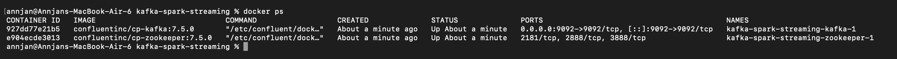
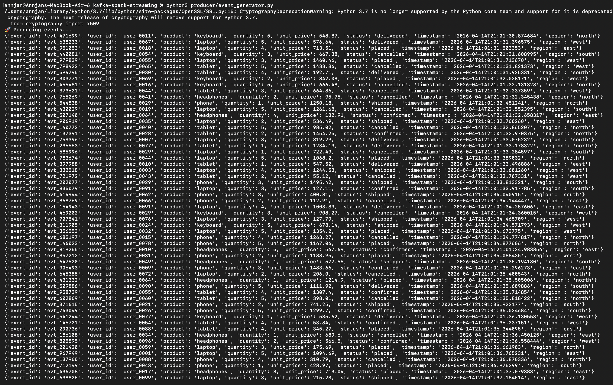
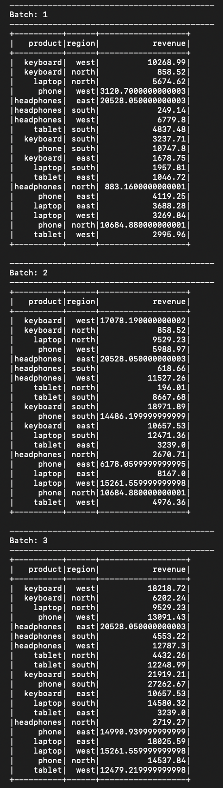
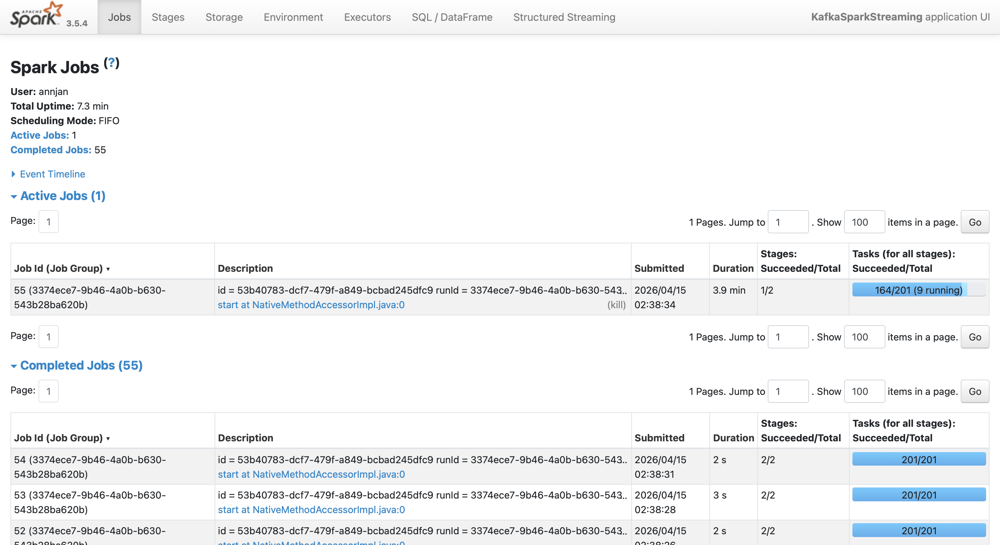

# 🚀 Real-Time Data Pipeline (Kafka + Spark Streaming)


---

## 📌 Overview
A **real-time distributed data pipeline** built using **Apache Kafka** and **Spark Structured Streaming** to process continuous event streams.

Processes streaming data in near real-time and performs aggregation across multiple dimensions (product, region) using micro-batch execution.

---

## 🏗️ Architecture



**Flow:**  
Producer → Kafka (`order_events`) → Spark Streaming → Aggregated Output

---

## ⚡ System Design Highlights
- Handles **continuous streaming data ingestion**
- Uses **Kafka as a distributed event broker**
- Implements **fault-tolerant micro-batch processing**
- Enables **scalable distributed execution via Spark**
- Designed to simulate **real-world data engineering pipelines**

---

## ⚙️ Tech Stack
- Apache Kafka  
- Apache Spark (Structured Streaming)  
- Docker & Docker Compose  
- Python (PySpark)  

---

## 🔥 Key Features
- ⚡ Real-time event ingestion using Kafka  
- ⚡ Scalable micro-batch processing using Spark  
- ⚡ Aggregation by product and region  
- ⚡ Fault-tolerant streaming execution  
- ⚡ Spark UI monitoring (jobs, stages, execution)  
- ⚡ Fully containerized deployment using Docker  

---

## 📂 Project Structure
```
kafka-spark-streaming/
│── docker-compose.yml
│── producer/
│   └── producer.py
│── streaming/
│   └── spark_consumer.py
│── images/
│   ├── architecture.png
│   ├── spark_ui_jobs.png
│   ├── kafka_topic_created.png
│   ├── spark_streaming_batches.png
│   ├── producer_events.png
│   └── kafka_running.png
```

---

## 🚀 Setup & Execution

### 1️⃣ Start Services
```bash
docker-compose up -d
```

### 2️⃣ Create Kafka Topic
```bash
docker exec -it kafka-spark-streaming-kafka-1 \
kafka-topics --create \
--topic order_events \
--bootstrap-server localhost:9092 \
--partitions 1 \
--replication-factor 1
```

### 3️⃣ Run Producer
```bash
python producer/producer.py
```

### 4️⃣ Run Spark Streaming
```bash
spark-submit \
--packages org.apache.spark:spark-sql-kafka-0-10_2.12:3.5.0 \
streaming/spark_consumer.py
```

---

## 📊 Sample Output

| Product     | Region | Revenue |
|------------|--------|--------|
| Keyboard   | North  | 73930  |
| Phone      | West   | 69289  |
| Headphones | East   | 67100  |

Streaming batches update continuously in real-time.

---

## 📸 Proof of Execution
- ✔ Kafka topic successfully created (`order_events`)  
- ✔ Continuous streaming batches processed  
- ✔ Spark UI showing active jobs, stages, and tasks  
- ✔ Aggregated results updating in real-time  

---

## 📸 Live Execution Screenshots

### 🔹 Kafka Topic Created


### 🔹 Kafka Running (Docker)


### 🔹 Producer Sending Events


### 🔹 Spark Streaming Batches


### 🔹 Spark UI - Jobs


---

## 🧪 Observability & Debugging
- Monitored streaming jobs using **Spark UI (port 4040)**
- Verified Kafka topics using CLI (`kafka-topics --list`)
- Debugged:
  - Topic/partition errors  
  - Kafka connection issues  
  - Spark-Kafka dependency setup  

---

## 🧠 Key Learnings
- Built an end-to-end **real-time data pipeline**
- Understood **Kafka producers, topics, and partitions**
- Worked with **Spark Structured Streaming internals**
- Debugged real-world streaming system issues  

---

## 💡 Future Improvements
- ⏱ Window-based aggregations (e.g., last 5 min revenue)  
- 💾 Persist results to database / data lake  
- 📊 Real-time dashboard using Streamlit or Grafana  
- ⚡ Multi-partition Kafka scaling  

---

## 👨‍💻 Author
**Annjan Arora**

---

## ⭐ If you found this useful, give it a star!